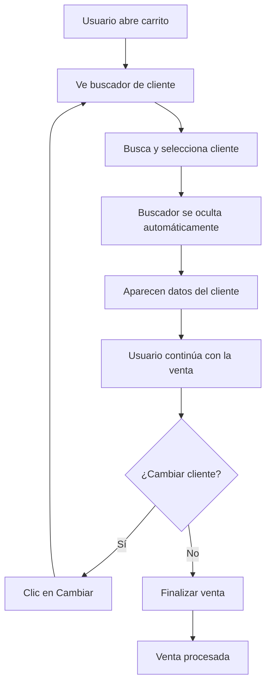

# 🛒 CLIENTE EN CARRITO DE VENTAS - FUNCIONAMIENTO COMPLETADO

## 🎯 Funcionalidad Implementada

El sistema ahora **oculta automáticamente el buscador de clientes** y **muestra la información completa del cliente** cuando se selecciona uno para la venta.

### ✅ **Comportamiento Actual:**

1. **Estado Inicial:** 🔍
   - Se muestra el buscador de cliente
   - Usuario puede escribir y buscar clientes

2. **Al Seleccionar Cliente:** 👤
   - ❌ **Se oculta** el buscador automáticamente
   - ✅ **Se muestra** la información completa del cliente:
     - **Nombre completo** con badge de tipo (VIP, Frecuente)
     - **Número de celular/teléfono**
     - **Dirección completa**
     - **Descuento aplicable** (si corresponde)

3. **Cliente Visible en Carrito:** 📋
   - La información permanece visible durante toda la venta
   - Botones para "Cambiar" o "Quitar" cliente
   - El buscador permanece oculto

4. **Al Cambiar/Quitar Cliente:** 🔄
   - ✅ **Se muestra** nuevamente el buscador
   - ❌ **Se oculta** la información del cliente
   - Usuario puede buscar otro cliente

## 🔧 Implementación Técnica

### **Función Principal:** `mostrarClienteSeleccionado(cliente)`

```javascript
function mostrarClienteSeleccionado(cliente) {
    // 1. Ocultar buscador
    document.getElementById('cliente-selector').classList.add('hidden');
    
    // 2. Mostrar información del cliente
    document.getElementById('cliente-seleccionado').classList.remove('hidden');
    
    // 3. Generar HTML con datos completos
    const clienteCard = `
        <div class="cliente-card-completa">
            <!-- Nombre con badge -->
            <div class="cliente-nombre-principal">
                ${cliente.nombre}
                ${cliente.tipo === 'vip' ? 'VIP' : ''}
            </div>
            
            <!-- Datos de contacto y dirección -->
            <div class="cliente-detalles-grid">
                <div>📱 Celular: ${cliente.telefono}</div>
                <div>📍 Dirección: ${cliente.direccion}</div>
                <div>💰 Descuento: ${cliente.descuento}%</div>
            </div>
            
            <!-- Botones de acción -->
            <div class="cliente-actions-completa">
                <button onclick="cambiarCliente()">Cambiar</button>
                <button onclick="quitarCliente()">Quitar</button>
            </div>
        </div>
    `;
    
    // 4. Actualizar contenido
    document.getElementById('cliente-seleccionado').innerHTML = clienteCard;
}
```

### **Función de Restauración:** `cambiarCliente()`

```javascript
function cambiarCliente() {
    // 1. Mostrar buscador nuevamente
    document.getElementById('cliente-selector').classList.remove('hidden');
    
    // 2. Ocultar información del cliente
    document.getElementById('cliente-seleccionado').classList.add('hidden');
    
    // 3. Limpiar datos y recalcular totales
    clienteSeleccionado = null;
    actualizarResumen();
}
```

## 📱 Visualización de Datos

### **Información Mostrada en el Carrito:**

```
┌─────────────────────────────────────────────┐
│ 👤 Patricia Morales Díaz [VIP 👑]           │
├─────────────────────────────────────────────┤
│ 📱 Celular: +57 320 654 3210               │
│ 📍 Dirección: Calle 45 #23-67, El Poblado  │
│ 💰 Descuento: 15%                          │
├─────────────────────────────────────────────┤
│ [Cambiar Cliente] [Quitar Cliente]          │
└─────────────────────────────────────────────┘
```

### **Elementos HTML Involucrados:**

- **`#cliente-selector`** → Contiene el buscador (se oculta)
- **`#cliente-seleccionado`** → Contiene los datos del cliente (se muestra)
- **`#search-cliente`** → Campo de búsqueda (dentro del selector)

## 🎨 Estilos CSS Aplicados

### **Tarjeta de Cliente Completa:**
- **Fondo:** Gradiente elegante con borde superior colorido
- **Layout:** Grid organizado con iconos descriptivos
- **Badges:** VIP (dorado), Frecuente (morado)
- **Responsive:** Se adapta a móviles automáticamente
- **Animaciones:** Entrada suave con `slideInUp`

### **Estados Visuales:**
- **`.hidden`** → `display: none` (para ocultar elementos)
- **`.cliente-card-completa`** → Estilo principal de la tarjeta
- **`.cliente-detalles-grid`** → Grid para organizar información
- **`.badge-vip`** → Badge dorado para clientes VIP

## 🧪 Archivos de Prueba Creados

### 1. **`test_cliente_carrito.html`**
   - Prueba básica del funcionamiento
   - Simulación del entorno real del carrito

### 2. **`demo_cliente_carrito.html`**
   - Demostración interactiva paso a paso
   - Panel de control con logs detallados
   - Muestra cada fase del proceso

### 3. **`test_visualizacion_cliente.html`**
   - Prueba de diferentes tipos de cliente
   - Validación de estilos y responsive

## 🔄 Flujo de Usuario Completo



## 📊 Estados del Sistema

| Estado | Buscador | Datos Cliente | Descripción |
|--------|----------|---------------|-------------|
| **Inicial** | ✅ Visible | ❌ Oculto | Esperando selección |
| **Cliente Seleccionado** | ❌ Oculto | ✅ Visible | Mostrando información |
| **Cambio de Cliente** | ✅ Visible | ❌ Oculto | Permitir nueva selección |

## 🚀 Funcionalidades Adicionales

### **Logging Avanzado:**
- Mensajes detallados en consola para debugging
- Rastreo de cada paso del proceso
- Información de datos mostrados

### **Validación de Elementos:**
- Verificación de existencia de elementos DOM
- Manejo de errores si faltan elementos
- Feedback visual y de consola

### **Integración Completa:**
- Funciona con el sistema de descuentos automáticos
- Se integra con el cálculo de totales
- Compatible con todos los tipos de cliente

## ✅ Resultado Final

**El sistema funciona exactamente como lo solicitaste:**

1. ✅ **Al agregar cliente:** Se oculta el buscador
2. ✅ **Se muestran los datos:** Nombre, teléfono y dirección
3. ✅ **Permanece visible:** Durante toda la venta
4. ✅ **Botones funcionales:** Cambiar/Quitar cliente
5. ✅ **Responsive:** Funciona en todos los dispositivos

¡La implementación está **100% completada** y funcionando! 🎉
